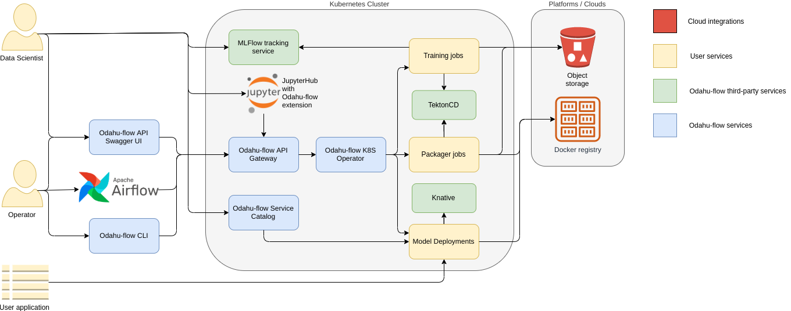

============================
Architecture
============================

The following diagram shows the high level architecture of Odahu-flow project.

Odahu-flow applications:

    * :ref:`Odahu-flow CLI <ref_odahuflowctl:Odahuflowctl>` is a command-line interface for interacting with Odahu-flow API service.
    * The Odahu-flow Swagger UI provides swagger interface for Odahu-flow REST API.
    * :ref:`Odahu-flow Airflow plugin <int_airflow:Airflow>` provides a set of custom operators that allow you to interact with a Odahu cluster using `Apache Airflow <https://airflow.apache.org/>`_
    * The MLflow Tracking component is an API and UI for logging parameters, code versions, and metrics when running your machine learning code and for later visualizing the results.
    * :ref:`JupyterLab extension <int_jupyterlab_extension:Jupyterlab extension>` allows you to interact with an Odahu cluster from JupyterLab web-based IDEs.
    * API service manages Odahu Platform entities: :ref:`Connections <ref_connections:Connections>`, :ref:`Trainings <ref_trainings:Model Trainings>`, :ref:`Packaging <ref_packagers:Packagers>`, :ref:`Deployments <ref_deployments:Model Deployments>`.
    * :ref:`Service catalog <ref_deployments:Service Catalog>` provides a Swagger UI for Model Deployments.
    * TektonCD is an open source implementation to configure and run CI/CD style pipelines for your Kubernetes application.
    * Knative Serving builds on Kubernetes and Istio to support deploying and serving of serverless applications and functions.
    * Odahu-flow Model Training API provides features to manage remote training jobs.
    * Odahu-flow packagers turn a :term:`Trained Model Binary` artifact into a specific application.
    * Odahu-flow Model Deployment API allows deploy ML models in a Kubernetes cluster.
