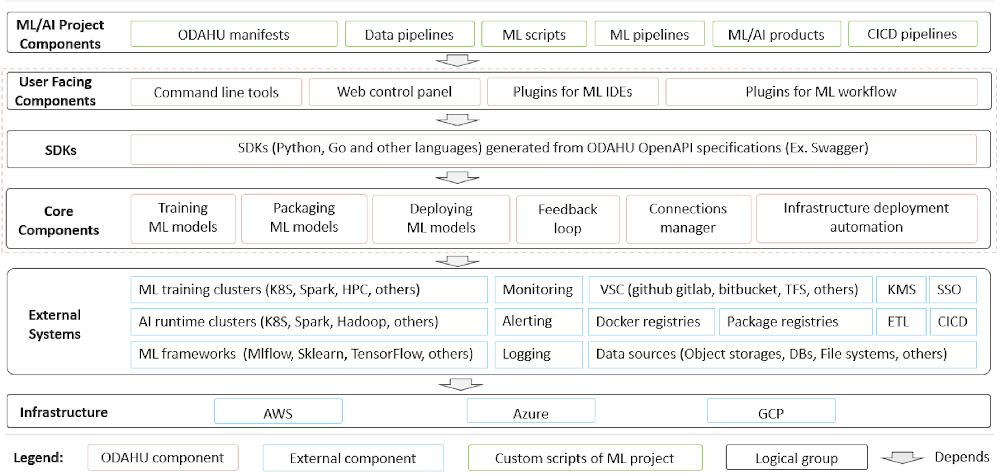

============================
Architecture
============================

The components diagram below shows high level architecture of ODAHU project.

Core components:

    * Training component for executing ML model training jobs in K8S.
    * Packaging component for wrapping up ML model binary to an online service, batch job, library or command line tool.
    * Deployment component for deploying ML model as a service or batch job.
    * Feedback Loop component for collecting prediction feedback and linking it with actual prediction request and response.
    * Connections component for managing credentials for external systems (data storages, code repositories, package repositories, docker registries, etc.) in a secure way. It uses HashiCorp Vault under the hood.
    * Deployment automation scripts for deploying ODAHU components to major cloud providers AWS, Azure, GCP.

Interfaces:

    * RESTful API
    * SDK for ODAHU components API generated from OpenAPI/Swagger specification.
    * Web control panel based on ODAHU SDK for interacting with ODAHU components via Web UI.
    * :ref:`Command line interface <ref_odahuflowctl:Odahuflowctl>` based on ODAHU SDK for interacting with ODAHU components via terminal commands.

Extensions for external tools:

    * Argo Workflow templates based on ODAHU SDK and CLI provide Argo Workflow steps for ODAHU Training, Packaging and Deployment APIs `Argo Workflow <https://argoproj.github.io/argo-workflows/>`_
    * :ref:`ODAHU Airflow plugin <int_airflow:Airflow>` based on SDK provides Airflow operators for ODAHU Training, Packaging and Deployment APIs `Apache Airflow <https://airflow.apache.org/>`_
    * :ref:`JupyterLab extension <int_jupyterlab_extension:Jupyterlab extension>` adds UI features to JupyterLab for interacting with ODAHU components.

