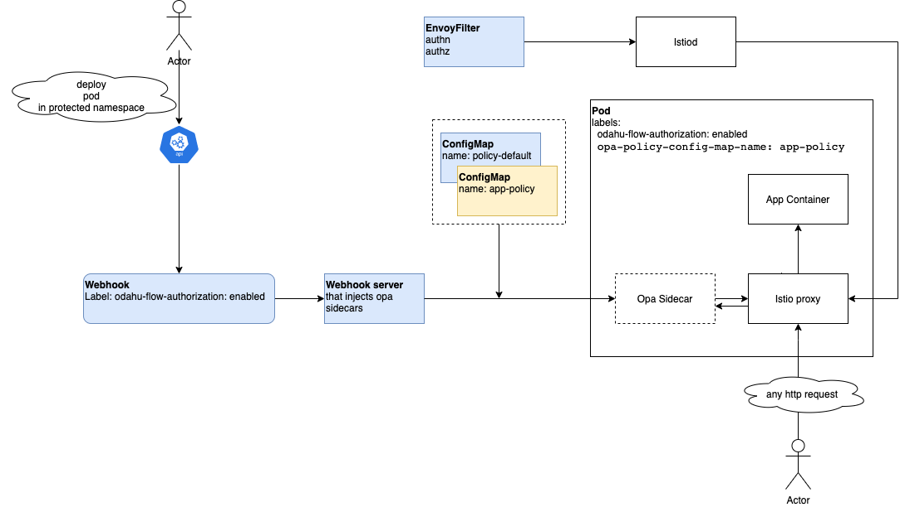

======================
Security subsystem
======================

Security subsystem is distributed as a helm chart and relies on `OpenPolicyAgent`_ to make decisions about authorization
and `Istio`_ to enforce authorization for requests to the protected services.

You can read about ODAHU security concepts in :ref:`an appropriate docs section<gen_security:Security>`

Implementation details
----------------------

Helm chart deploys

- Webhook server that injects `OpenPolicyAgent`_ sidecars into pods that labeled by ``odahu-flow-authorization=enabled``
- EnvoyFilter that configures Istio-proxy sidecars located in pods labeled by ``odahu-flow-authorization=enabled``
  to force authentication and authorization for all incoming http requests
- ConfigMap with common policy that included into all `OpenPolicyAgent`_ sidecars and implements masking of a sensitive data
- ConfigMap with default policy that included into `OpenPolicyAgent`_ sidecars when pod does not specify ConfigMap with its polices

When webhook server deploys `OpenPolicyAgent`_ sidecar it attaches policies from ConfigMap. ConfigMap can be found by
value of pod label ``opa-policy-config-map-name``. If this label is missed then default policy will be used.
Default policy – reject all requests.

Different ODAHU components such as :ref:`API <comp_api:API>` and :ref:`Feedback aggregator <comp_feedback:Feedback aggregator>`
are distributed with a pre-defined set of OpenPolicyAgent_ policies. They create ConfigMap with their policies during the deployment process.

If user change ConfigMap with policies then appropriate pod must be restarted to refresh its policies.

.. csv-table::
   :stub-columns: 1
   :width: 100%

    "Technologies used", "OpenPolicyAgent, Istio"
    "Distribution representation", "Helm chart"
    "Source code location", "`packages/operator <https://github.com/odahu/odahu-flow/tree/develop/packages/feedback>`_"
    "Can be used w/o Odahu Platform?", "No"
    "Does it connect to other services?", "Yes (Kubernetes, OpenPolicyAgent, Istio)"
    "Can it be deployed locally?", "If a local Kubernetes cluster is present"
    "Does it provide any interface?", "No"

.. Links

.. _`Istio`: https://istio.io
.. _OpenPolicyAgent: https://www.openpolicyagent.org/
