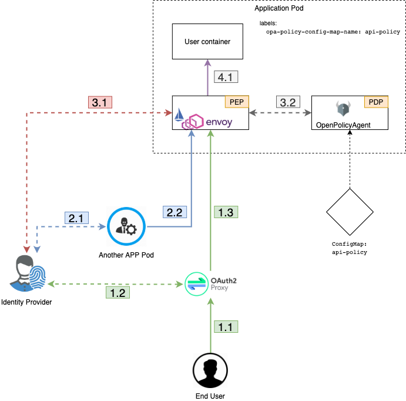

#########
Security
#########

Prime goals of ODAHU Security system is  to provide
`authentication <https://en.wikipedia.org/wiki/Authentication>`_,
`authorization <https://en.wikipedia.org/wiki/Authorization>`_
and give users a flexible access control management solution.

The first section `Security overview`_  shows the general design of authentication and authorization is described.
Look at this section to have a deep understanding of how ODAHU security works under the hood or to learn basic concepts.

The second section `Use built-in policies`_ describes how to add users permissions to use ODAHU via your idP_
and ODAHU pre-defined roles

The third section `Configure built-in policies`_ describes how you can get more flexibility
such as adding new roles, map attributes for ODAHU RBAC from `JWT claims`_
or writing your policy that could be more generic than RBAC like `Access based access control`_.

.. contents:: Content table
   :local:

**************************
Security overview
**************************

Component roles
==================

There are some common terms related to access control management systems.
In this documentation, the next ones are commonly used.

.. _idP:

Identity Provider (idP)
  A component that provides information about an entity (user or service).
  In ODAHU the role of idP can do any `OpenID Connect`_ compatible provider.

.. _PEP:

Policy Enforcement Point (PEP)
  A component that enforces security policies against each request to API or other protected resources.
  In ODAHU the role of PEP plays `Envoy proxy`_.

.. _PDP:

Policy Decision Point (PDP)
  A component that decides whether the request (action in the system) should be permitted or not.
  In ODAHU role of PDP plays `OpenPolicyAgent`_.

API Request lifecycle
==================================

To have a better understanding of how all ODAHU security components work together
let's review the API request lifecycle and describe what is happened for each HTTP request.

1. HTTP Request could be made from the outside of the cluster perimeter.

   1. In this case, the request is handled by OAuth2Proxy_ via Kubernetes ingress controller
   2. OAuth2Proxy looks up cookies that contain JWT Token issued by idP_.
      If there are no such cookies it redirects the request to idP_.
      After successful login OAuth2Proxy set issued token to cookies (and also to) and send the request to upstream.
      Before proxying requests to upstream OAuth2Proxy add `Authorization Request Header Field`_ from the cookie automatically by setting it from the cookie.
   3. OAuth2Proxy send request to upstream.

2. HTTP Request from inside the cluster perimeter. Such requests usually made by background processes inside the cluster
   on behalf of service accounts.

   1. Service should previously authenticate in idP using `OpenID Connect`_ protocol.
      The most suitable way to authenticate services is `OAuth2 Client Credentials Grant`_
   2. Service makes a request to API using issued JWT token as `Authorization Request Header Field`_

3. Envoy proxy as PEP_ that is configured as sidecar container by `Istio Pilot`_ for those ODAHU components that must be
   protected ensures that security policy allows making this request to ODAHU API

   1. Envoy verifies JWT token in `Authorization Request Header Field`_  using `JSON Web Token (JWT) Authentication`_ filter
   2. Envoy makes a query to OpenPolicyAgent_ as PDP_ using `External Authorization`_ filter passing parsed JWT token from the previous step

4. If request if permitted by OpenPolicyAgent_ it is sent to upstream (ODAHU API)

***********************
Use built-in policies
***********************

ODAHU is distributed with build-in policies that are written on `Rego policy language`_.

`Role based access control`_ is implemented by default.
But there is nothing you need to know about rego policies language as long as
the set of pre-defined roles fits your needs. In this section, you can see such roles and how to manage them
using Keycloak as an example of idP_

Pre-defined roles overview
============================

ODAHU has next predefined roles:

  #. 'odahu_viewer' – can do any GET requests to any API resources
  #. 'odahu_data_scientist' – allowed requests:

     #. Action: GET, Resource pattern: api/v1/connection
     #. Action: GET, Resource pattern: api/v1/packaging/integration
     #. Action: GET, Resource pattern: api/v1/toolchain/integration
     #. Action pattern: ALL, Resource pattern:  api/v1/model/training
     #. Action pattern: ALL, Resource pattern:  api/v1/model/packaging
     #. Action pattern: ALL, Resource pattern:  api/v1/model/deployment

  #. 'odahu_admin' – can do any requests to any API resources

Example of role management with Keycloak
=========================================

Because of ODAHU relies on any `OpenID Connect`_ provider as idP_ user roles are expected to be set as `JWT Claims`_.
How to assign roles of the user as JWT Claims depends on certain OpenID provider, but almost all of them provide such a feature.
By default, ODAHU expects a list of roles in 'realm_access.roles' claim inside JWT token. (This is default roles location for Keycloak).
But if you have another idP_ and can not configure it to pass roles in that claim you can configure mapper
(see more in `Customize default mapper`_).
In this section we show how to (using Keycloak as idP_):

Create ODAHU pre-defined roles in your idP_
--------------------------------------------

Create roles from section `Pre-defined roles overview`_ in your Keycloak as
`Realm Specific Roles <https://www.keycloak.org/docs/latest/server_admin/#realm-roles>`_.

  #. Select appropriate Keycloak realm
  #. Add clients from `Pre-defined roles overview`_:

     #. odahu_viewer
     #. odahu_data_scientist
     #. odahu_admin

Set user role manually
------------------------

To manually set up created role use `User Role Mapping <https://www.keycloak.org/docs/latest/server_admin/#user-role-mappings>`_

Set user role automatically
------------------------

If you don't create and manage users in your realm manually but rather use
`Identity Broker <https://www.keycloak.org/docs/latest/server_admin/#_identity_broker>`_ then you can configure
that all new users that will be exported from the broker will have certain ODAHU role by default.

To set default role create mapper with type 'Hardcoded Role' in broker settings as described in
`Keycloak Mapping Claims and Assertions <https://www.keycloak.org/docs/latest/server_admin/#_mappers>`_.

Create a service account with some roles
----------------------------------------

If you are going to use ODAHU API from bot or service (not human) then you should use
`Service account <https://www.keycloak.org/docs/latest/server_admin/#_service_accounts>`_.

Create OIDC client with access type
`Confidential Client Credentials <https://www.keycloak.org/docs/latest/server_admin/#_client-credentials>`_
and add some ODAHU roles to its service account as described in
`Adding or removing roles for client’s service account <https://www.keycloak.org/docs/latest/server_admin/#adding-or-removing-roles-for-client-s-service-account>`_.

*****************************
Configure built-in policies
*****************************

In this section, different ways to manage access control in ODAHU is described

Built-in policies overview
===========================

ODAHU is distributed with a pre-defined set of OpenPolicyAgent_ policies. These policies implement  simple
`Role based access control`_ (RBAC).

Next features are implemented using `Rego policy language`_:

  #. Set of predefined roles with assigned permissions
  #. Default mapper that match `JWT Claims`_ to attributes that ODAHU RBAC policy expects
  #. ODAHU RBAC core policy

These features are implemented in the next files:

  * roles.rego – all odahu roles are listed here
  * permissions.rego – permissions for roles
  * input_mapper.rego – mapper to match `JWT Claims`_ to attributes ODAHU RBAC rely on. These attributes include:

    * user – info about user or service who makes the request (this property contains roles attribute with a list of roles)
    * action – HTTP verb of the request
    * resource – URL of the request

  * core.rego – core implementation of `Role based access control`_.

All policies customization can be done on the stage of system configuration as described in
:ref:`installation guide <tutorials_installation:Installation>`

Extend roles
=======================

To define new custom roles you should just add it as a variable in file `roles.rego`

.. code-block:: javascript
   :name: Add new role
   :caption: roles.rego
   :linenos:
   :emphasize-lines: 1

    package odahu.roles

    admin := "admin"
    data_scientist := "data_scientist"
    viewer := "viewer"

    # new role
    connection_manager := "connection_manager"

Then you need to set permissions to that role in file `permissions.rego`

.. code-block:: javascript
   :name: Set permissions for a new role
   :caption: permissions.rego
   :linenos:
   :emphasize-lines: 20-22

    package odahu.permissions

    import data.odahu.roles

    permissions := {
      roles.data_scientist: [
          [".*", "api/v1/model/deployment.*"],
          [".*", "api/v1/model/packaging.*"],
          [".*", "api/v1/model/training.*"],
          ["GET", "api/v1/connection.*"],
          ["GET", "api/v1/packaging/integration.*"],
          ["GET", "api/v1/toolchain/integration.*"]
        ],
      roles.admin : [
          [".*", ".*"]
      ],
      roles.viewer : [
          ["GET", ".*"]
      ],
      roles.connection_manager : [
          [".*", "api/v1/connection.*"]
      ],
    }

In this file, we:

- lines 20-22: add permissions to any request to api/v1/connection.* URL for a new role

Customize default mapper
========================

You can configure `mapper.rego` to extend input that is passed to `core.rego` file with RBAC implementation

.. code-block:: javascript
   :name: Configure mapper
   :caption: mapper.rego
   :linenos:

   package odahu.mapper

   import data.odahu.roles

   roles_map = {
     "odahu_admin": roles.admin,
     "odahu_data_scientist": roles.data_scientist,
     "odahu_viewer": roles.viewer
   }

   jwt = input.attributes.metadata_context.filter_metadata["envoy.filters.http.jwt_authn"].fields.jwt_payload

   keycloak_user_roles[role]{
     role = jwt.Kind.StructValue.fields.realm_access.Kind.StructValue.fields.roles.Kind.ListValue.values[_].Kind.StringValue
   }

   user_roles[role]{
     role = roles_map[keycloak_user_roles[_]]
   }

   parsed_input = {
     "action": input.attributes.request.http.method,
     "resource": input.attributes.request.http.path,
     "user": {
       "roles": user_roles
     }
   }

In this file, we:

- lines 5-9: map roles from jwt claims to policies roles from `roles.rego`
- lines 11-19: extract roles from claims and match them to policies roles
- lines 21-26: create input that is expected by file `core.rego` that contains resource, action and user's roles

Create custom policies
========================

If `Role based access control`_ is not enough for your purposes you can customize policies to
use more general `Access based access control`_. For this rewrite `core.rego` file or create your own rego policies

.. code-block:: javascript
   :name: ODAHU Role based access implementation
   :caption: core.rego
   :linenos:

   package odahu.core

   import data.odahu.mapper.parsed_input
   import data.odahu.permissions.permissions

   default allow = false

   allow {
     any_user_role := parsed_input.user.roles[_]
       any_permission_of_user_role := permissions[any_user_role][_]
       action := any_permission_of_user_role[0]
       resource := any_permission_of_user_role[1]

       re_match(action, parsed_input.action)
       re_match(resource, parsed_input.resource)
   }

   allow {
      parsed_input.action == "GET"
     parsed_input.resource == "/"
   }

   allow {
     parsed_input.action == "GET"
    re_match("/swagger*", parsed_input.resource)
   }

In this file, we:

- lines 8-16: allow access if there are required permissions for action and resource for at least one user's roles
- lines 12-21: allow access to root for any user
- lines 23-26: allow access to swagger docs to any user

.. Links

.. _`Istio Pilot`: https://istio.io/docs/ops/deployment/architecture/#pilot
.. _`Envoy proxy`: https://www.envoyproxy.io/
.. _`External Authorization`: https://www.envoyproxy.io/docs/envoy/latest/intro/arch_overview/security/ext_authz_filter
.. _`JSON Web Token (JWT) Authentication`: https://www.envoyproxy.io/docs/envoy/latest/intro/arch_overview/security/jwt_authn_filter
.. _`Authorization Request Header Field`: https://tools.ietf.org/html/rfc6750#section-2.1
.. _OpenPolicyAgent: https://www.openpolicyagent.org/
.. _OAuth2Proxy: https://pusher.github.io/oauth2_proxy/
.. _`OAuth2 Client Credentials Grant`: https://tools.ietf.org/html/rfc6749#section-4.4
.. _`Role based access control`: https://en.wikipedia.org/wiki/Role-based_access_control
.. _`Access based access control`: https://en.wikipedia.org/wiki/Attribute-based_access_control
.. _`Rego policy language`: https://www.openpolicyagent.org/docs/latest/policy-language/
.. _`JWT claims`: https://tools.ietf.org/html/rfc7519#section-4
.. _`OpenID Connect`: https://openid.net/specs/openid-connect-core-1_0.html
