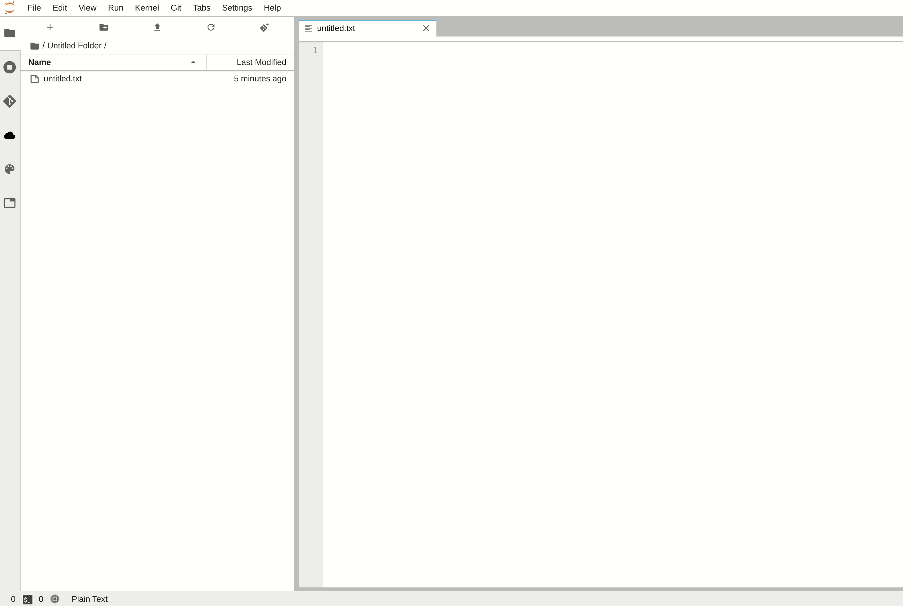
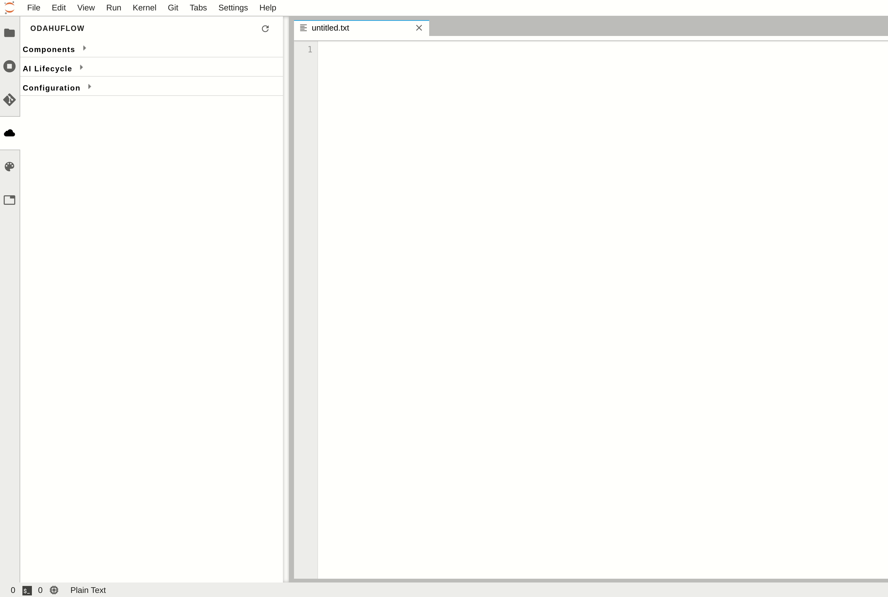
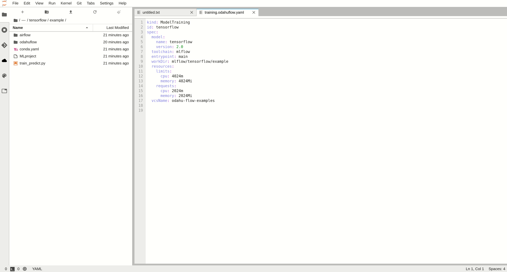

######################
Jupyterlab extension
######################

Odahu-flow provides the JupyterLab extension that allows you to interact with an Odahu cluster from JupyterLab web-based IDEs.

***********************
Installation
***********************

To install the extension, perform the following steps:

.. code-block:: bash

    pip install odahu-flow-jupyterlab-plugin
    jupyter serverextension enable --sys-prefix --py odahuflow.jupyterlab
    jupyter labextension install odahu-flow-jupyterlab-plugin

Another option is `prebuilt Jupyterlab Docker Image <https://hub.docker.com/repository/docker/odahu/odahu-flow-jupyterlab>`_ with the extension.

***********************
Configuration
***********************

The extension can be configured though the environment variables.

.. csv-table::
   :header: "Environment name", "Default", "Description"
   :widths: 20, 30, 40

   "DEFAULT_API_ENDPOINT", "", "Default URL to the Odahu-flow API server"
   "API_AUTH_ENABLED", "true", "Change the value to false if authorization is disabled on the Odahu-flow API server"

***********************
Login
***********************

To authorize on an Odahu-flow API service in the Jupyterlab extension, you should perform the following steps:

    * Copy and paste the Odahu-flow API service URL.
    * Open an API server URL in a browser to get the token. Copy and paste this token in the login form.

***********************
Usage
***********************

Below we consider all views of the JupyterLab extension.

Templates
---------

The extension provides predefined list of API file templates. You can create a file from a template.

Main view
---------

The main view contains all Odahu-flow entities. You can view or delete them.

Log viewer
----------

For troubleshooting, you can get access to the training, packaging or deployment logs.
If the job is running then logs will be updated in runtime.

.. image:: img/logs.gif

Submit resources
----------------

You can create any Odahu-flow entities from the extension.
The button ``Submit`` only appears in the context menu when file ends with ``.yaml`` or ``json``.

