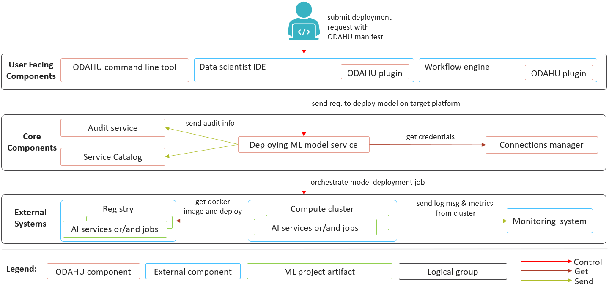
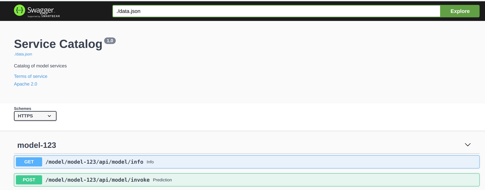
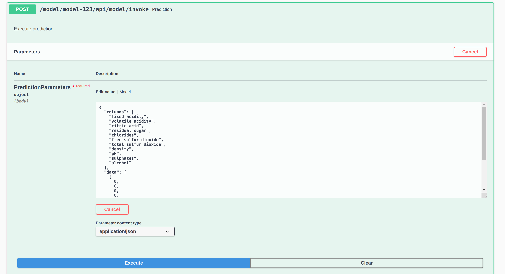
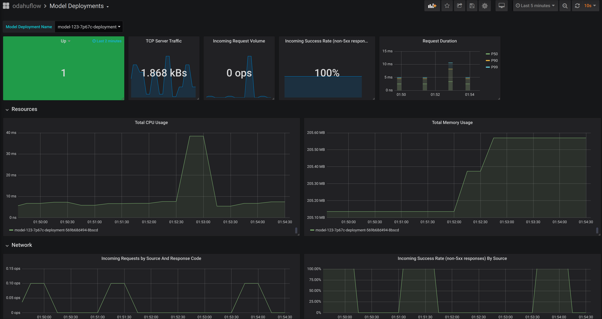

######################
Model Deployments
######################

Odahu-flow Model Deployment API allows deploy of ML models in a Kubernetes cluster.
Additionally, it provides the following set of features:

    * Feedback loop
    * Scale to zero
    * Dynamic Model swagger
    * Monitoring of Model Deployment

***************************
Inference Servers
***************************

A model can be deployed in ODAHU if only it is packed with a supported Inference Server.
Inference Server is typically a web service that "wraps" an ML model and lets remote clients to invoke
the model via HTTP (or any other protocol).

An Inference Servers that wraps the model has to be indicated in :code:`predictor` field of a Model Deployment.

ODAHU currently supports several Inference Servers:

- ODAHU Inference Server: :code:`predictor: odahu-ml-server`
- NVIDIA Triton Inference Server: :code:`predictor: triton`

ODAHU Inference Server
################

Value for "predictor" field of Model Deployment: :code:`predictor: odahu-ml-server`

ODAHU Inference Server is an inference server that builds a simple HTTP layer on top of any
`MLFlow model <https://www.mlflow.org/docs/latest/models.html>`_ with an HTTP layer.

To pack a model into ODAHU Inference Server :ref:`Docker REST <ref_packagers:Docker REST>` packager has to be used.

NVIDIA Triton Inference Server
####################

Value for "predictor" field of Model Deployment: :code:`predictor: triton`

`Triton Server <https://github.com/triton-inference-server/server>`_ is a feature-rich inference server.
To pack a model into a Triton Server, :ref:`Triton Packager <ref_packagers:Nvidia Triton Packager>` has to be used.

Triton Server uses `KFServing Inference Protocol <https://github.com/kubeflow/kfserving/blob/master/docs/predict-api/v2/required_api.md>`_.

********************************************
General Deployment Manifest Structure
********************************************

.. code-block:: yaml
    :caption: Deployment API

    kind: ModelDeployment
    # Some unique value among all deployments
    # Id must:
    #  * contain at most 63 characters
    #  * contain only lowercase alphanumeric characters or ‘-’
    #  * start with an alphabetic character
    #  * end with an alphanumeric character
    id: wine-12345
    spec:
        # Predictor is an inference backend name; required field
        # Possible values are: odahu-ml-server, triton
        predictor: odahu-ml-server

        # Model image is required value. Change it
        image: gcr.io/project/test-e2e-wine-1.0:b591c752-43d4-43e0-8392-9a5715b67573
        # If the Docker image is pulled from a private Docker repository then
        # you have to create a Odahu-flow connecton and specify its id here.
        # imagePullConnID: test

        # Compute resources for the deployment job.
        resources:
          limits:
            cpu: 1
            memory: 1Gi
          requests:
            cpu: 1
            memory: 1Gi

        # Minimum number of replicas
        minReplicas: 0
        # Maximum number of replicas
        maxReplicas: 1

***************************
Model Deployment management
***************************

Model Deployments can be managed using the following ways.

Swagger UI
----------

ModelDeployments are available in the Swagger UI at http://api-service/swagger/index.html URL.

Odahu-flow CLI
--------------

:ref:`ref_odahuflowctl:Odahuflowctl` supports the Model Deployment API.
You must be :ref:`logged in <ref_odahuflowctl:Login>` if you want to access the API.

Getting all model deployments in json format:

.. code-block:: bash

    odahuflowctl deployment get --format json

Getting the model name of the model deployments:

.. code-block:: bash

    odahuflowctl deployment get --id tensorflow-cli -o 'jsonpath=[*].spec.model.name'

* Creating of a deployment from `deploy.yaml` file:

.. code-block:: bash

    odahuflowctl deployment create -f deploy.yaml

* All model deployments commands and documentation:

.. code-block:: bash

    odahuflowctl deployment --help

* All model deployments commands and documentation:

.. code-block:: bash

    odahuflowctl deployment --help

* Getting a model deployment information:

.. code-block:: bash

    odahuflowctl model info --md wine

* Making a prediction:

.. code-block:: bash

    odahuflowctl model invoke --md wine --file request.json

JupyterLab
----------

Odahu-flow provides the :ref:`int_jupyterlab_extension:JupyterLab extension` for interacting with Model Deployments API.

********************************************
Service Catalog
********************************************

Service catalog provides a Swagger UI for Model Deployments.

.. note::

    The model must provide :ref:`input and output samples<ref_trainings:MLFlow protocol>` to appear in the Service Catalog

Service catalog Swagger UI:

Example of a prediction request:

********************************************
Grafana Dashboard
********************************************

Out of the box, Odahu-flow provides the Grafana Model Deployment dashboard.
It contains the charts with following system metrics:

    * availability
    * replicas
    * CPU
    * memory
    * number of failed HTTP requests
    * latency
    * ...

Example of the dashboard:

********************************************
Feedback
********************************************

**Model Feedback** provides a view of performance over all stages of model lifecycle.

The mechanism is simple:

1. Ask Deploy for prediction (with or without ``Request-Id`` provided)
2. Send prediction feedback to Odahu-flow  (with ``Request-Id`` returned from previous step)
3. Odahu-flow stores the prediction and feedback to a configurable location

.. important::

   This flow requires ``feedback`` to be enabled in ``values.yaml`` during Helm chart installation

Protocol
--------

1. If prediction is requested without Request-ID: ``Request-ID`` header with random ID is added to the request. Otherwise, Request-ID is not generated.
2. Request and response are stored on configured external storage (eg. S3, GCS)
3. User sends Model Feedback as an argument to the feedback endpoint. (Feedback can be arbitrary JSON.)
5. All Feedback is persisted on external storage and can be used by models during subsequent Trains.

Working example
~~~~~~~~~~~~~~

Making a prediction request:

.. code-block:: bash

    curl -X POST -vv "https://``cluster-url``/model/``model-deployment-id``/api/model/invoke" \
    -H "Authorization: Bearer ``JWT`` \
    -H "accept: application/json" \
    -H "Content-Type: application/json" \
    -d "{ \"columns\": [ \"fixed acidity\", \"volatile acidity\", \"citric acid\", \"residual sugar\", \"chlorides\", \"free sulfur dioxide\", \"total sulfur dioxide\", \"density\", \"pH\", \"sulphates\", \"alcohol\" ], \"data\": [ [ 0, 0, 0, 0, 0, 0, 0, 0, 0, 0, 0 ] ]}"

The response contains a generated ``Request-Id`` header.

.. code-block:: txt

    HTTP/2 200
    server: nginx/1.13.12
    date: Tue, 17 Dec 2019 10:58:49 GMT
    content-type: application/json
    content-length: 45
    model-name: test-e2e-wine
    model-version: 1.0
    request-id: 6fa1f636-fb80-9979-b8c6-d78f5e90f0c1
    x-envoy-upstream-service-time: 43
    strict-transport-security: max-age=15724800; includeSubDomains

    {"prediction": [6.0], "columns": ["quality"]}

Requests and responses are persisted in a bucket. (File name ~= ``/request_response/income/1.1/year=2019/month=07/day=24/2019072414_4.json``)

The first file contains meta-information about request and response:

.. code-block:: json

    {
      "request_id": "6fa1f636-fb80-9979-b8c6-d78f5e90f0c1",
      "request_content": "{\"columns\": [\"alcohol\", \"chlorides\", \"citric acid\", \"density\", \"fixed acidity\", \"free sulfur dioxide\", \"pH\", \"residual sugar\", \"sulphates\", \"total sulfur dioxide\", \"volatile acidity\"], \"data\": [[12.8, 0.029, 0.48, 0.98, 6.2, 29, 3.33, 1.2, 0.39, 75, 0.66]]}",
      "request_uri": "/model/test-e2e-wine/api/model/invoke",
      "response_http_headers": {
        ":status": "200",
        "date": "Tue, 17 Dec 2019 08:46:40 GMT",
        "model-name": "test-e2e-wine",
        "model-version": "1.0",
        "server": "istio-envoy",
        "connection": "close",
        "content-length": "45",
        "content-type": "application/json",
        "request-id": "12dcddd5-771d-9fc0-b326-816211cf8172",
        "x-envoy-upstream-service-time": "6"
      },
      "model_version": "1.0",
      "request_http_headers": {
        ":method": "POST",
        "x-scheme": "https",
        "accept": "*/*",
        "x-istio-attributes": "ClEKF2Rlc3RpbmF0aW9uLnNlcnZpY2UudWlkEjYSNGlzdGlvOi8vb2RhaHUtZmxvdy1kZXBsb3ltZW50L3NlcnZpY2VzL3Rlc3QtZTJlLXdpbmUKUwoYZGVzdGluYXRpb24uc2VydmljZS5ob3N0EjcSNXRlc3QtZTJlLXdpbmUub2RhaHUtZmxvdy1kZXBsb3ltZW50LnN2Yy5jbHVzdGVyLmxvY2FsCisKGGRlc3RpbmF0aW9uLnNlcnZpY2UubmFtZRIPEg10ZXN0LWUyZS13aW5lCjgKHWRlc3RpbmF0aW9uLnNlcnZpY2UubmFtZXNwYWNlEhcSFW9kYWh1LWZsb3ctZGVwbG95bWVudApPCgpzb3VyY2UudWlkEkESP2t1YmVybmV0ZXM6Ly9pc3Rpby1pbmdyZXNzZ2F0ZXdheS04NjlkYjdkOWJiLWpsemtyLmlzdGlvLXN5c3RlbQ==",
        "knative-serving-namespace": "odahu-flow-deployment",
        "x-envoy-original-path": "/model/test-e2e-wine/api/model/invoke",
        ":scheme": "http",
        "x-forwarded-host": "odahu.example.com",
        "x-original-uri": "/model/test-e2e-wine/api/model/invoke",
        "user-agent": "python-requests/2.22.0",
        "x-forwarded-port": "443",
        "content-type": "application/json",
        "x-b3-sampled": "1",
        "content-length": "257",
        "x-real-ip": "10.4.0.11",
        "x-forwarded-for": "10.4.0.11,10.44.0.10",
        "x-envoy-external-address": "10.44.0.10",
        "x-request-id": "12dcddd5-771d-9fc0-b326-816211cf8172",
        "x-forwarded-proto": "http",
        ":authority": "odahu.example.com",
        "x-b3-traceid": "488abe197a652c2ce80e6b848a4c56e6",
        ":path": "/api/model/invoke",
        "accept-encoding": "gzip, deflate",
        "x-envoy-decorator-operation": "test-e2e-wine.odahu-flow-deployment.svc.cluster.local:80/model/test-e2e-wine/api*",
        "x-b3-spanid": "e80e6b848a4c56e6",
        "knative-serving-revision": "test-e2e-wine-l4xt7"
      },
      "response_status": "200",
      "request_host": "odahu.example.com",
      "model_name": "test-e2e-wine",
      "request_http_method": "POST",
      "time": "2019-12-17 08:46:40 +0000"
    }

The second file contains the response body with the same ``Request-Id`` (File name ~= ``/response_body/income/1.1/year=2019/month=07/day=24/2019072414_1.json``)

.. code-block:: json

    {
      "request_id": "6fa1f636-fb80-9979-b8c6-d78f5e90f0c1",
      "model_version": "1.0",
      "model_name": "test-e2e-wine",
      "response_content": "{\"prediction\": [6.0], \"columns\": [\"quality\"]}",
      "time": "2019-12-17 08:46:40 +0000"
    }

Working Example - Send Feedback as Payload
~~~~~~~~~~~~~~~~~~~~~~~~~~~~~~~~~~~~~~~~~

Send Model Feedback request:

.. code-block:: bash

    curl -X POST -vv "${BASE_URL}/feedback/model/" \
    -H "Authorization: Bearer ${JWT}" \
    -H "x-model-name: income" \
    -H "x-model-version: 1.1" \
    -H "Request-ID: previous-prediction-id" \
    -H 'Content-Type: application/json' \
    -d '{"truthful": 1}'

Note that the ``-d`` argument can pass arbitrary JSON.

A successful feedback request will have the following properties:

- HTTP response: 200
- Response field ``error`` is ``false``.
- Response field ``registered`` is ``true``.
- Response field ``message`` is what was sent to storage.

.. code-block:: json
    :caption: Example response

    {
      "message": {
        "RequestID": "previous-prediction-id",
        "ModelVersion": "1.0",
        "ModelName": "test-e2e-wine",
        "Payload": {
          "json": {
            "truthful": 1
          }
        }
      }
    }

File name ~= ``/feedback/test-e2e-wine/1.0/year=2019/month=11/day=23/2019072311_2.json`` will have a format like this,
with feedback stored in the ``payload`` field:

.. code-block:: json

    {
      "request_id": "previous-prediction-id",
      "model_version": "1.0",
      "model_name": "test-e2e-wine",
      "payload": {
        "json": {
          "truthful": 1.0
        }
      },
      "time": "2019-12-17 20:08:05 +0000"
    }
